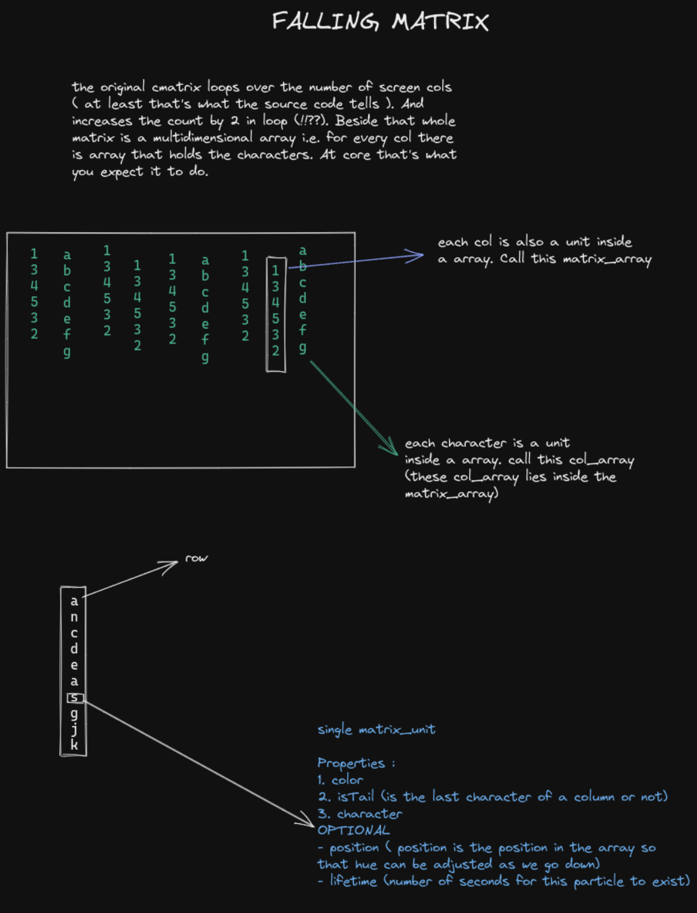

# WEBCMATRIX

A falling matrix inspired from [cmatrix](https://github.com/abishekvashok/cmatrix/).
Currently live [here](ps173.github.io/webcmatrix)

You can also tweak colors by setting color item in localstorage.

1. Do `ctrl+shift+j` or just open `Developer tools console`
2. In console type following

```js
localStorage.setItem("color", "any color that you want");
```

3. Now reload the page and see the matrix with your color

# How to generate the same effect yourself ?

Here are the notes that I made. It's a very simple mechanism and nothing complex
really. If you prefer video then here's a wonderful video on [coding train](https://www.youtube.com/watch?v=S1TQCi9axzg)

